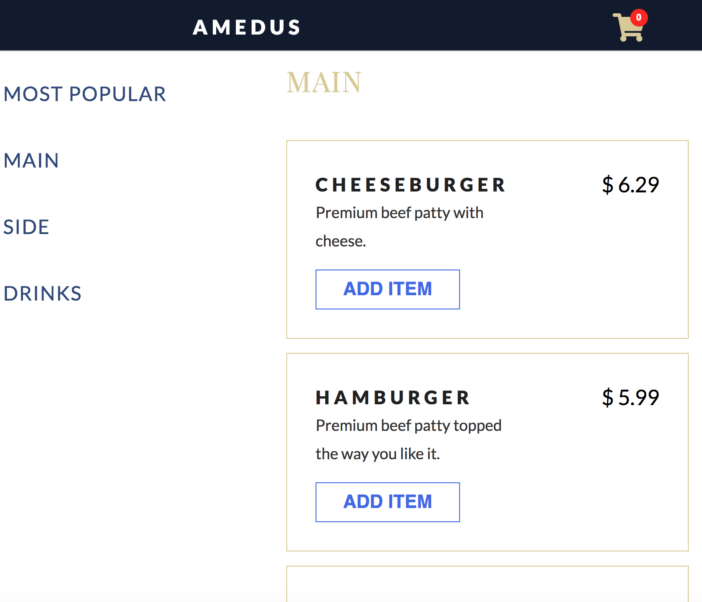
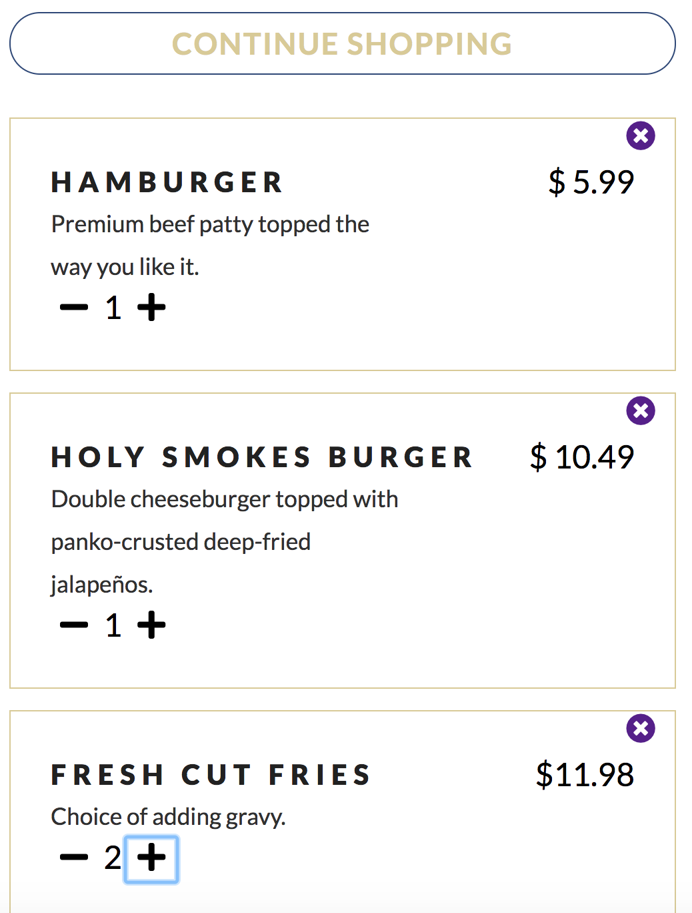
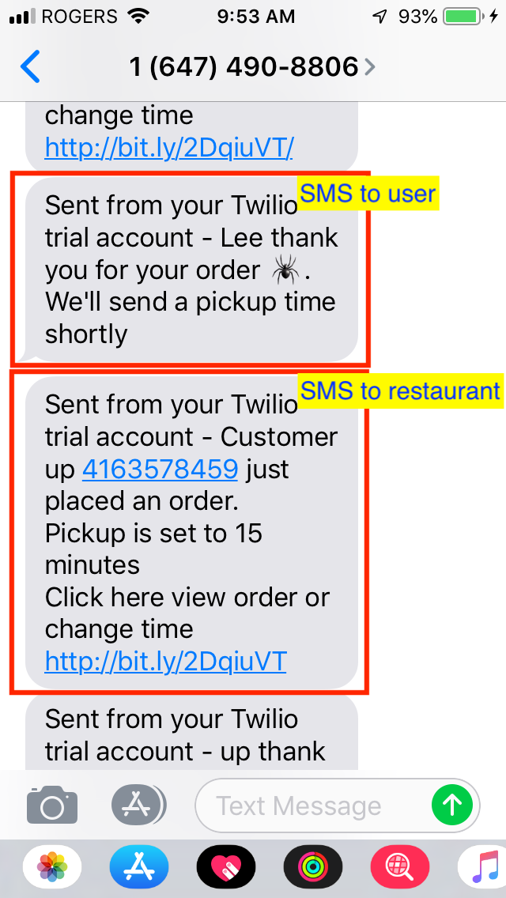
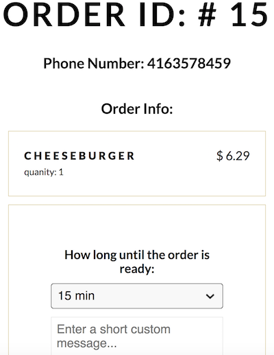
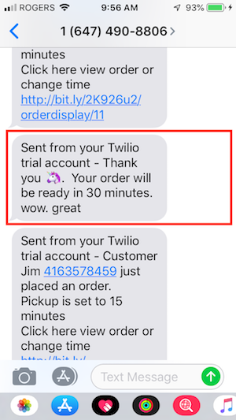

## Amedus-project

Amedus is a simple restaurant app.

Users are provided a menu of items to add to a shopping cart.  They may remove items from the cart as well as increase the quanity of a particular item.  Pricing totals will update dynamically.  Once the user confirms their order they provide their telephone number and payment information (payment info for placeholding purposes only).  The user is sent an SMS confirming their order while the restaurant is sent an SMS indicating an order has been placed (the user name, telephone number and a link to review the user order is provided).  The restaurant owner has the option to click the link in the SMS and choose to edit the time for order pickup, cancel the order and add an optional custom message.  The contents of the message are sent via SMS to the user.

## Dependencies

  - body-parser 1.15.2
  - card 2.4.0
  - cookie-session 2.0.0-beta.3
  - dotenv 2.0.0
  - ejs 2.4.1
  - express 4.13.4
  - knex 0.11.7
  - knex-logger 0.1.0
  - morgan 1.7.0
  - node-sass-middleware 0.9.8
  - pg 6.0.2
  - twilio 3.23.2

## Getting Started

S...please fill this in ....what you need to do to run it...migration...npm run local etc.

## Functionality

The user clicks the 'Order Now' button in the center of the page scrolls down to a menu.  User can .  If the form field exceeds 140 characters the counter moves past zero to negative numbers and the counter color changes color to red.

A succesful tweet submission immediately:
- publishes the tweet below the form
- empties the text entry field
- resets the counter to 140

## File Structure

Important folders and files are indicated in the tree diagram below:

<ul>
  <li>/Amedus</li>
  <ul>
    <li>/db</li>
    <ul>
      <li>/migrations: list of previous dB migraitons</li>
      <li>/seeds: intial data set of menu items and test orders</li>
    </ul>
    <li>/public</li>
    <ul>
      <li>/assets: contains graphics and screenshots</li>
      <li>/css: styling </li>
      <li>/dist</li>
      <li>/saas</li>
      <li>/scripts</li>
      <li>/vendor</li>
    </ul>
    <li>/routes</li>
    <ul>
      <li>cart.js: </li>
      <li>checkout.js:</li>
      <li>orderdisplay.js:</li>
    </ul>
    <li>/views</li>
    <ul>
      <li>/partials: </li>
      <li>checkout.ejs</li>
      <li>index.ejs: </li>
      <li>orderdisplay.ejs: </li>
    </ul>
    <li>README.md</li>
    <li>knexfile.js</li>
    <li>package.json</li>
    <li>server.js</li>
  </ul>
</ul>

## Screenshots
======
### Homescreen:

### Menu:

### Cart with dynamic pricing changes:

### Initial SMS to user(customer) and restaurant:

### Order page where restaurant can set pickup time and custom message:

### Final SMS to user indicating time for pickup:

